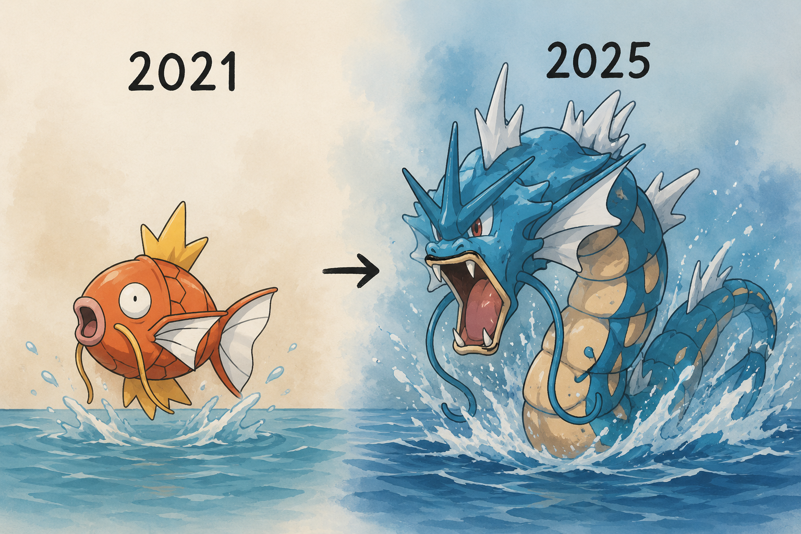

# Hi, I'm Laura

Cloud & AI Engineer

Currently building AI-powered solutions, cloud-native architectures, and distributed systems designed to operate reliably, efficiently, and at scale.

## Technologies & Areas of Expertise

### Artificial Intelligence

* Applied AI and LLM-powered systems
* RAG and multi-agent architectures
* Agent orchestration (LangChain, LangGraph, Strands)
* Document processing, multimodal systems, and real-time AI
* Voice, audio, and conversational interfaces
* Open-source models and local AI
* Amazon Bedrock and SageMaker

### Cloud, DevOps & Architecture

* Cloud Architecture on AWS
* Infrastructure as Code with AWS CDK
* Containers and serverless platforms
* Relational and NoSQL databases
* Event-driven architectures
* Process orchestration and automation
* Security, IAM, and access management
* CI/CD pipelines and deployment automation
* Resilient, scalable, and cost-efficient system design
* Observability, governance, and operational excellence

### Backend & Integration

* Backend services with Python, FastAPI, TypeScript, and Java
* REST API design and implementation
* Microservices and distributed systems
* Integration between platforms, services, and external systems
* Process automation and business workflows

### Frontend

* Web application development
* React, Astro, and TypeScript
* Interactive and immersive user experiences

## About Me

I enjoy designing and building systems that combine artificial intelligence, cloud computing, and automation to solve real-world problems.

My experience spans AI-powered applications, document processing, conversational systems, process automation, distributed architectures, and cloud platforms. Over the last few years, I have focused on designing solutions on AWS while applying principles of resilience, scalability, security, and operational efficiency.

I am particularly interested in the intersection of artificial intelligence and cloud architecture, where intelligent systems must integrate reliably with production environments, process information in real time, and scale sustainably.

Beyond implementation, I believe engineering is not only about building software but about solving real problems in a responsible and effective way. My goal is to design solutions that provide tangible value while balancing innovation, operational simplicity, long-term sustainability, and cost efficiency. I enjoy creating systems that are easy to evolve, straightforward to operate, and capable of scaling as needs grow over time.

Outside of professional work, I enjoy exploring new technologies through personal projects and hands-on experimentation. I am especially interested in multimodal systems, audio processing, conversational interfaces, immersive experiences, and new ways for people to interact with technology.

I am currently expanding my knowledge in solution architecture, distributed systems, and applied artificial intelligence, with the goal of building increasingly robust, innovative, and impactful platforms.

*Still learning. Sometimes I know things.*

---

## Connect With Me

  

  

  

Still learning. Sometimes I know things.

